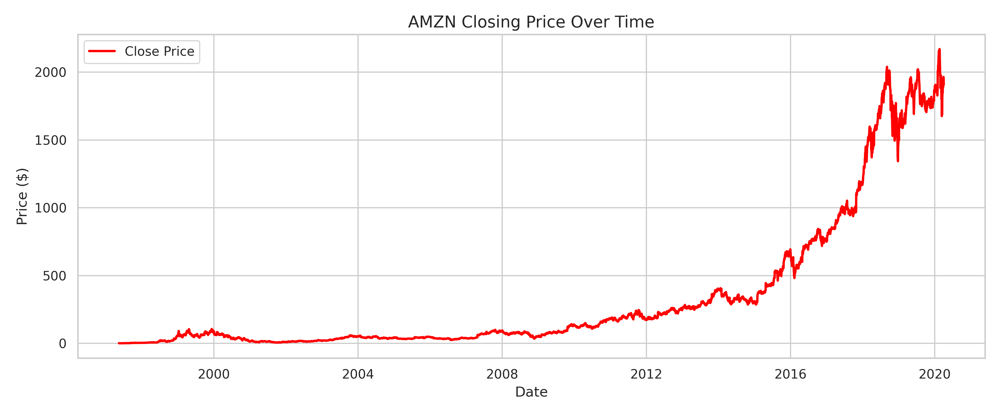
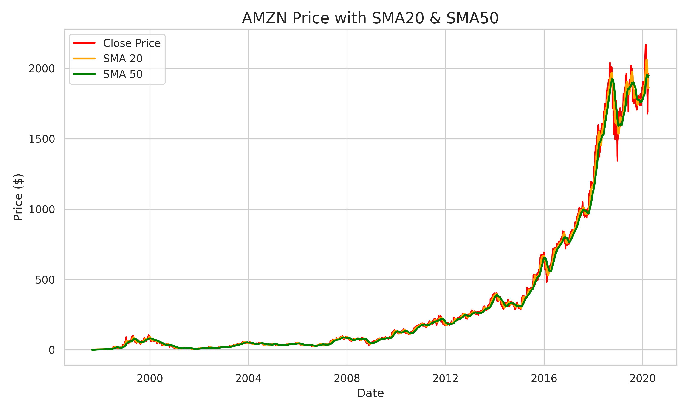
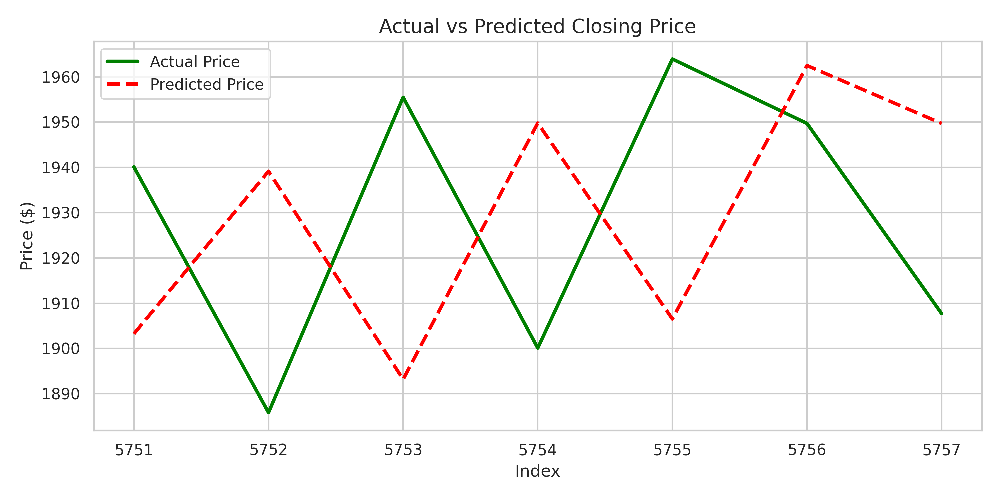

# 📈 Task 2 – Stock Price Prediction with Buy/Sell Strategy

I made a Stock Price Prediction Model using Stock Price Data available in Kaggle for my Machine Learning Internship at **Future Interns**

---

## 📊 Dataset
- **Source**: [Stock Market Dataset](https://www.kaggle.com/datasets/jacksoncrow/stock-market-dataset)
- Used historical stock data for **AMZN (Amazon.com Inc.)**

---

## 🎯 Objective
A machine learning model that can predict short-term stock price trends using Linear Regression and generate trading strategy signals using SMAs.

---

## 🧠 What I Did

1. **Data Preprocessing**
   - Cleaned and visualized AMZN price trends
   - Added SMA20 and SMA50 moving averages

2. **Model Implementation**
   - Created lag features (previous 7 days of prices)
   - Trained a **Linear Regression** model
   - Predicted the next 7 days of stock prices

3. **Evaluation**
   - Metrics used:  
     - MAE: `44.92`  
     - RMSE: `47.48`  
     - MAPE: `2.33%`

---

## 📸 Visuals

### Closing Price  

### SMA20 + SMA50  

### Actual vs Predicted  

---

## 💡 Business Insight

- SMA crossovers help traders identify **entry and exit** points
- Short-term predictions assist in **portfolio timing**
- Combined ML + rule-based logic for real-world use
